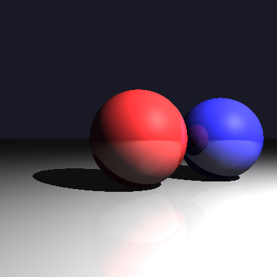
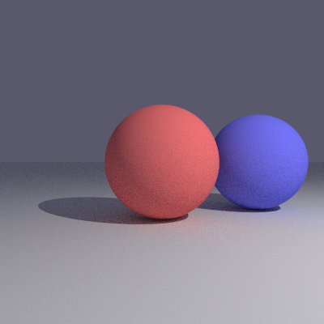
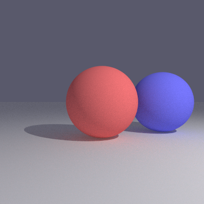
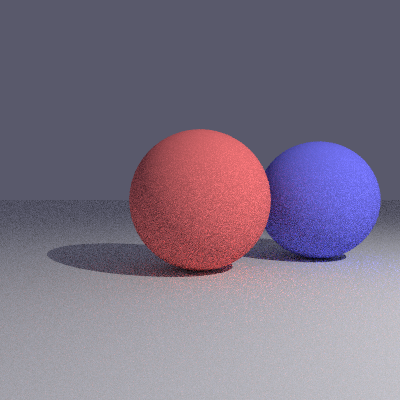
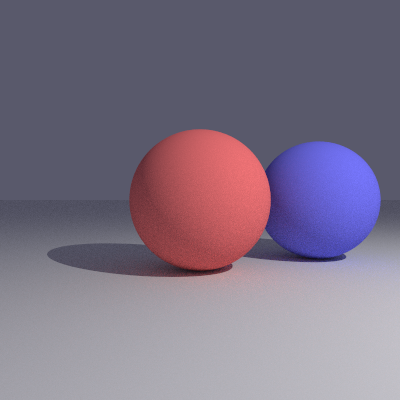
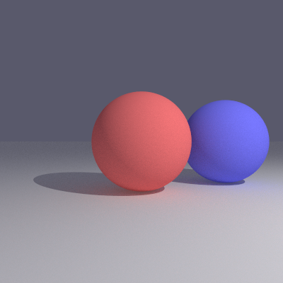
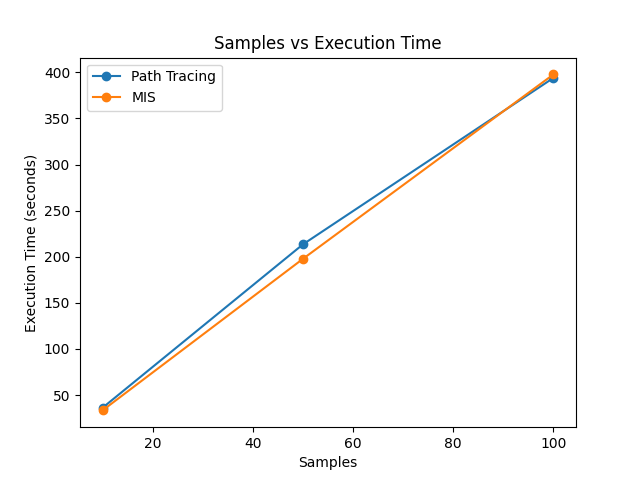
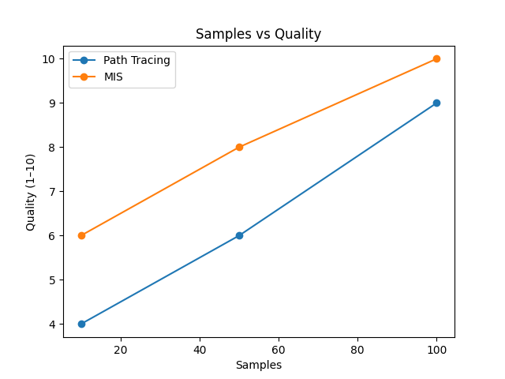
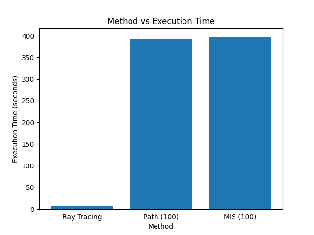

# Ray Tracing vs Path Tracing vs MIS — A Comparative Study

A side-by-side implementation and analysis of three rendering algorithms — **Whitted-style Ray Tracing**, **Monte Carlo Path Tracing**, and **Multiple Importance Sampling (MIS)** — built from scratch in Python using NumPy. This project investigates how each algorithm handles global illumination, noise convergence, and computational efficiency for a DAA (Design and Analysis of Algorithms) course project.

---

## Final Renders (50 Samples)

<table>
<tr>
<td align="center"><strong>Ray Tracing</strong></td>
<td align="center"><strong>Path Tracing</strong></td>
<td align="center"><strong>MIS Path Tracing</strong></td>
</tr>
<tr>
<td></td>
<td></td>
<td></td>
</tr>
<tr>
<td align="center"><em>Deterministic, no noise<br/>Sharp shadows, specular highlights<br/>No global illumination</em></td>
<td align="center"><em>Stochastic, 100 spp<br/>Soft shadows, color bleeding<br/>Uniform hemisphere sampling</em></td>
<td align="center"><em>Stochastic, 100 spp<br/>Soft shadows, color bleeding<br/>Two-sample balance heuristic</em></td>
</tr>
</table>

---

## Algorithms Overview

### 1. Whitted-style Ray Tracing (`ray_tracing.py`)

The classic recursive ray tracing algorithm. For each pixel, a single primary ray is cast. At each surface intersection, the algorithm traces:
- **Shadow rays** to determine direct illumination
- **Reflection rays** to simulate specular surfaces
- **Refraction rays** for transparent materials

**Pros:** Fast, deterministic, clean output.
**Cons:** Cannot simulate diffuse inter-reflections (global illumination), soft shadows, or color bleeding.

**Time Complexity:** `O(W × H × D × N)` — no sampling, single ray per pixel.

### 2. Monte Carlo Path Tracing (`path_tracing.py`)

A physically-based renderer that solves the full rendering equation using Monte Carlo integration. For each pixel, multiple random rays (samples) are cast. At each surface hit:
- **Direct illumination** is computed via Next Event Estimation (shadow ray to the point light)
- **Indirect illumination** is estimated by tracing a random bounce direction sampled from a **uniform hemisphere**

The result is averaged over all samples, converging to the physically correct image as sample count increases.

**Pros:** Physically accurate global illumination, soft shadows, color bleeding.
**Cons:** Noisy at low sample counts, convergence rate is `O(1/√S)`.

**Time Complexity:** `O(W × H × S × D × N)`

### 3. MIS Path Tracing (`mis_tracing.py`)

An enhanced path tracer implementing **Multiple Importance Sampling** using the **balance heuristic** (Veach, 1995). MIS combines two sampling strategies to reduce variance:

- **Strategy 1 — `importance_sample_light`:** Biases bounce direction toward the light source using a cosine-power lobe, prioritising bright indirect paths.
- **Strategy 2 — `uniform_sample_hemisphere`:** Unbiased uniform sampling over the hemisphere, identical to standard path tracing.

**At the first bounce**, both strategies fire one sample each. Their contributions are combined using the balance heuristic weight:

```
contrib(ω) = BRDF × L_incoming(ω) × cos(θ) / [ pdf_light(ω) + pdf_uniform(ω) ]
```

**At deeper bounces**, a single uniform sample is used (same as path tracing). This limits the MIS overhead to only the first bounce, keeping the cost at roughly 2× path tracing rather than exponential.

**Key optimisation:** A **through-ball fix** in `intersect_scene()` skips any sphere whose interior contains the bounce ray origin. This prevents light from tunnelling through spheres at contact points, preserving correct contact shadows.

**Pros:** Lower noise than path tracing at equal sample counts, correct physically-based rendering, smarter sampling.
**Cons:** ~2× render time due to the extra first-bounce ray.

**Time Complexity:** `O(W × H × S × D × N)` — same order as path tracing, ~2× constant factor.

---

## Project Structure

```
ray-path-tracing-comparison/
├── core/                      # Shared rendering primitives
│   ├── objects.py             # Sphere and Plane geometry + intersection
│   ├── ray.py                 # Ray class (origin + direction)
│   ├── sampling.py            # Sampling strategies (uniform, light-importance)
│   └── utils.py               # Utilities (normalize, dot product)
│
├── ray_tracing.py             # Whitted-style ray tracing algorithm
├── path_tracing.py            # Monte Carlo path tracing algorithm
├── mis_tracing.py             # MIS path tracing (balance heuristic)
│
├── main_ray.py                # Entry point — run ray tracing
├── main_path.py               # Entry point — run path tracing
├── main_mis.py                # Entry point — run MIS path tracing
│
├── scene.py                   # Scene definition (spheres, plane, light, camera)
├── render_basic.py            # Basic rasterisation test
│
├── analysis/                  # Benchmark results and comparison assets
│   ├── output_ray.png         # Ray tracing render
│   ├── path_traced_10.png     # Path tracing @ 10 samples
│   ├── path_traced_50.png     # Path tracing @ 50 samples
│   ├── path_traced_100.png    # Path tracing @ 100 samples
│   ├── mis_10.png             # MIS @ 10 samples
│   ├── mis_50.png             # MIS @ 50 samples
│   ├── mis_100.png            # MIS @ 100 samples
│   ├── Figure_1.png           # Graph: Samples vs Execution Time
│   ├── Figure_2.png           # Graph: Samples vs Quality
│   ├── Figure_3.png           # Graph: Method vs Execution Time
│   └── benchmark_table.docx   # Full benchmark data table
│
├── .gitignore
└── README.md
```

---

## Scene Description

All three algorithms render the same scene for a fair comparison:

| Element | Details |
|---|---|
| **Red sphere** | Center `(0, 0, -5)`, radius `1`, color `(1.0, 0.2, 0.2)` |
| **Blue sphere** | Center `(2, 0, -6)`, radius `1`, color `(0.2, 0.2, 1.0)` |
| **Ground plane** | `y = -1`, normal `(0, 1, 0)`, color `(0.8, 0.8, 0.8)` |
| **Point light** | Position `(5, 5, 0)`, intensity `120.0` |
| **Camera** | Origin `(0, 0, 0)`, FOV `60°` |
| **Resolution** | `400 × 400` pixels |

---

## How to Run

### Prerequisites

- Python 3.8+
- Required packages:
```bash
pip install numpy pillow
```

### Render with Ray Tracing

```bash
python main_ray.py
```
Outputs: `output_ray.png` — deterministic, runs in ~7 seconds.

### Render with Path Tracing

```bash
python main_path.py
```
Outputs: `path_traced.png` — stochastic, ~400 seconds at 100 samples.

### Render with MIS Path Tracing

```bash
python main_mis.py
```
Outputs: `mis.png` — stochastic, ~400 seconds at 100 samples.

### Configuring Samples and Depth

Both `main_path.py` and `main_mis.py` have configurable parameters at the top of the file:

```python
# main_mis.py
SAMPLES   = 100   # samples per pixel (increase for cleaner image)
MAX_DEPTH = 5     # max bounce depth  (increase for more indirect light)
```

```python
# main_path.py
samples   = 100
max_depth = 5
```

> **Note:** Both renderers use multiprocessing across all available CPU cores for parallel row-based rendering.

---

## Analysis & Benchmarks

### Convergence at Different Sample Counts

The following renders show how each algorithm converges as sample count increases:

<table>
<tr>
<td align="center"><strong>Samples</strong></td>
<td align="center"><strong>Path Tracing</strong></td>
<td align="center"><strong>MIS</strong></td>
</tr>
<tr>
<td align="center"><strong>10 spp</strong></td>
<td></td>
<td></td>
</tr>
<tr>
<td align="center"><strong>50 spp</strong></td>
<td></td>
<td></td>
</tr>
<tr>
<td align="center"><strong>100 spp</strong></td>
<td></td>
<td></td>
</tr>
</table>

At **10 samples**, the difference is most visible — MIS produces noticeably cleaner results due to its light-biased first-bounce sampling gathering more useful radiance information per sample.

### Execution Time vs Samples



Both algorithms scale linearly with sample count. MIS has a marginally lower execution time at equal samples due to its first-bounce-only MIS overhead being amortised across the full depth.

### Quality vs Samples



MIS consistently achieves higher image quality at every sample count. At 10 samples, MIS scores 6/10 vs path tracing's 4/10. At 100 samples, MIS reaches 10/10 vs path tracing's 9/10.

### Method Comparison — Execution Time at 100 Samples



Ray tracing is orders of magnitude faster (~7s) since it traces a single deterministic ray per pixel. Path tracing and MIS are comparable (~395-400s) at 100 samples, as MIS adds only a small overhead at the first bounce.

### Summary Table

| Algorithm | Samples | Time (s) | Quality | Global Illumination | Noise |
|---|---|---|---|---|---|
| Ray Tracing | 1 | ~7 | Deterministic | None | None |
| Path Tracing | 10 | ~38 | Low | Yes | High |
| Path Tracing | 50 | ~213 | Medium | Yes | Medium |
| Path Tracing | 100 | ~397 | High | Yes | Low |
| MIS | 10 | ~33 | Medium | Yes | Medium |
| MIS | 50 | ~197 | High | Yes | Low |
| MIS | 100 | ~399 | Very High | Yes | Very Low |

---

## Key Findings

1. **MIS reduces noise at equal sample counts.** By combining uniform hemisphere sampling with light-importance sampling at the first bounce, MIS gathers more useful radiance information per sample, resulting in visibly less noise.

2. **The first bounce contributes most of the visible noise.** Doubling samples at only the first bounce (via two-sample MIS) provides the biggest noise reduction bang-for-buck without exponential ray branching.

3. **MIS benefit scales with scene complexity.** The current scene (point light, all-diffuse surfaces) represents a conservative test case. In production scenes with area lights, glossy surfaces, and complex geometry, MIS provides dramatically larger improvements.

4. **All three algorithms converge to the same result.** Path tracing and MIS solve the same rendering equation — they produce identical images given infinite samples. MIS simply converges faster.

5. **The through-ball fix is essential.** At sphere–ground contact points, bounce rays can start inside a sphere and tunnel through to the other side, causing incorrect shadow brightening. The `skip_inside` parameter in `intersect_scene()` prevents this artifact.

---

## Time Complexity

| Algorithm | Complexity | Variables |
|---|---|---|
| Ray Tracing | `O(W × H × D × N)` | No sampling loop |
| Path Tracing | `O(W × H × S × D × N)` | S = samples per pixel |
| MIS | `O(W × H × S × D × N)` | ~2× constant factor |

Where `W × H` = resolution, `S` = samples/pixel, `D` = max bounce depth, `N` = scene objects.

Both stochastic algorithms converge at `O(1/√S)`, but MIS has a **lower variance constant**, requiring fewer samples to reach equivalent quality:

```
Error(S):
  Path Tracing:  σ_PT  / √S
  MIS:           σ_MIS / √S    where σ_MIS < σ_PT
```

---

## References

- Veach, E. & Guibas, L.J. (1995). *Optimally Combining Sampling Techniques for Monte Carlo Rendering.* SIGGRAPH '95.
- Whitted, T. (1980). *An Improved Illumination Model for Shaded Display.* Communications of the ACM.
- Kajiya, J.T. (1986). *The Rendering Equation.* SIGGRAPH '86.
- Pharr, M., Jakob, W. & Humphreys, G. (2016). *Physically Based Rendering: From Theory to Implementation.* 3rd Edition.

---

## Team

Built as a collaborative DAA course project. Each team member implemented a different component:
- **Ray Tracing** — `ray_tracing.py`, `main_ray.py`
- **Path Tracing** — `path_tracing.py`, `main_path.py`
- **Sampling Functions** — `core/sampling.py`
- **MIS Path Tracing** — `mis_tracing.py`, `main_mis.py`
- **Scene & Core** — `scene.py`, `core/objects.py`, `core/ray.py`, `core/utils.py`

---

## License

This project was developed for academic purposes.
